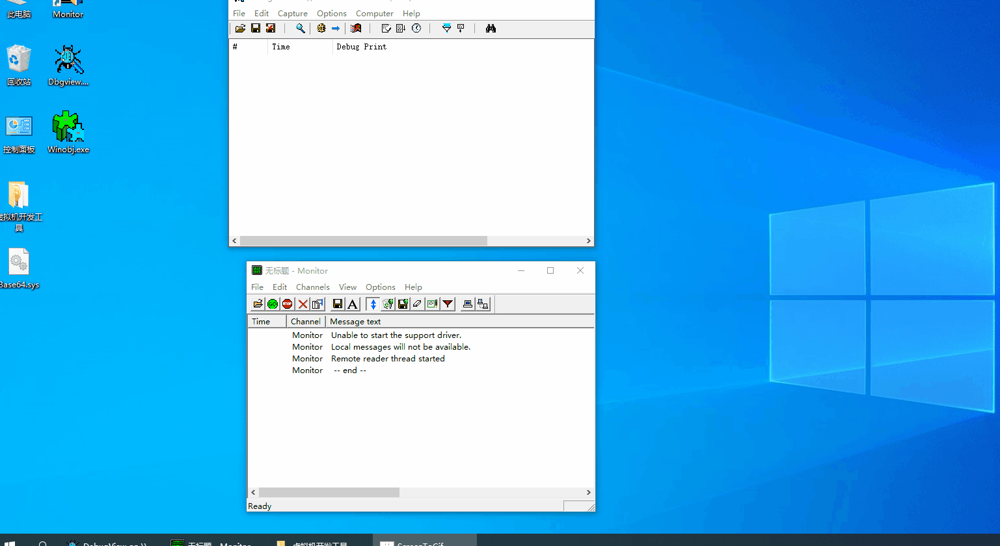

<h1 align="center">
	
	 
	 
</h1>
&emsp;  
&emsp;  
# Win-Kernel-Crypto
Windows kernel encryption library, support aes-256, rsa-2048 and higher,, ecc-256, single file, minimal dependence, support R0 and R3  
For more paid encryption library, please contact QQ 1031154724  
# Windows内核加密
windows内核加密库，支持Base64、AES-256、RSA-2048以及更高、ECC-256，单文件，依赖极小，同时支持R0和R3。  
更多付费加密库请联系QQ 1031154724  

